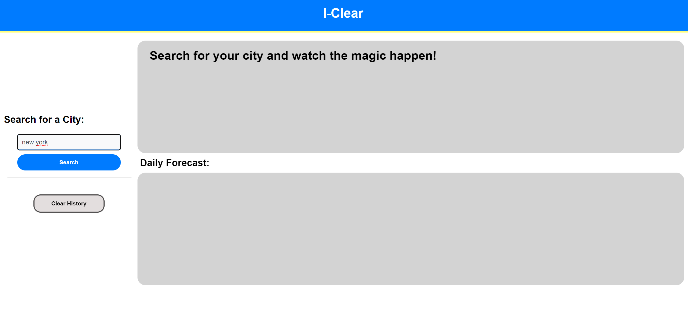
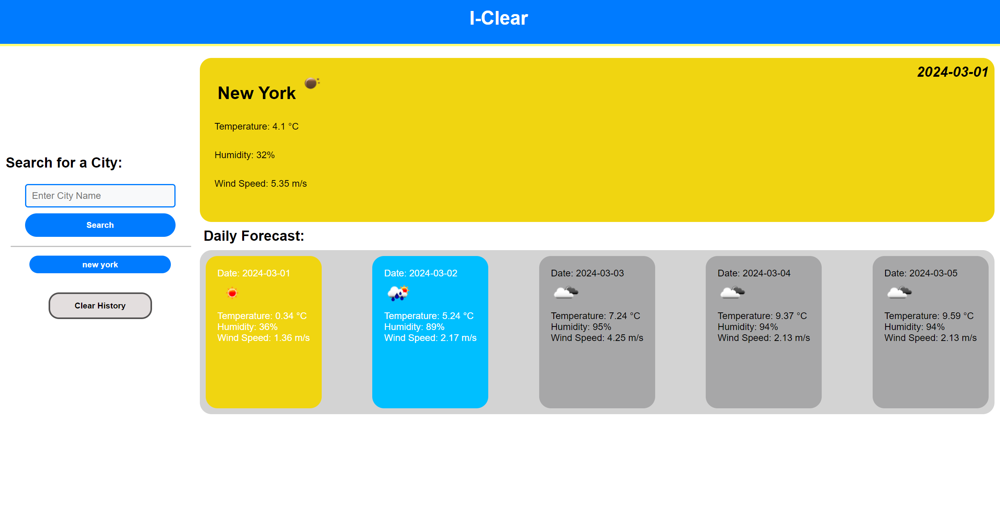

# I-clear

## Description
I created this weather app to gain experience with server side API's but I decided to have a lot more fun design wise. Especially when I started to understand the api and it's functionality, I was able to get it all done and make my project unique. The way I did this was by noticing that I had been using a colour scheme that was reminiscent of the ikea branding. From there I decided to name my webpage I-clear which is a spin on the word ikea. I went the extra mile and added functionality based on the weather icon being displayed within the weather div which really helped me further my understanding and solidify my recall of the topic. This leads me to my main takeaway from this week's assignment which is that building something unique, funny or something that you are passionate about, even if only a little bit will make the learning process alot easier and in my case help to retain the information gathered.
## Installation
No installation needed, just follow the link provided!: https://lwse13.github.io/Weather-app/
## Usage
You will be greeted by a welcome page where you can input a city name and search. If you have previously used the site your search results will be saved

After searching your current weather forecast for the chosen city will display as well as a 5 day forecast. The colours of each container will change dependant of the weather icon that is used

## Credits
N/A
## License
N/A
